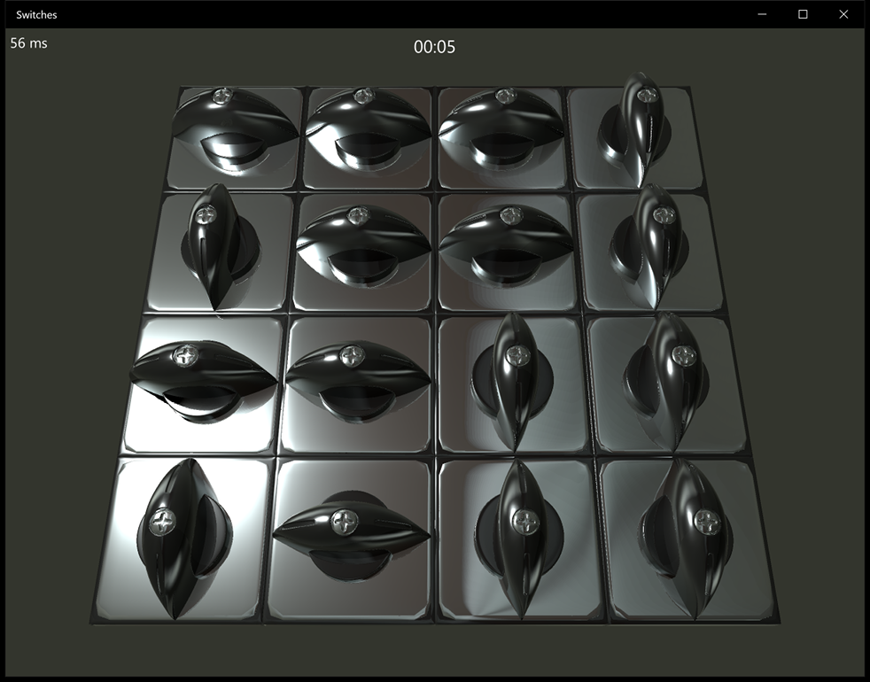

# Switch

Switch is a small logic game that demonstrates usage of [Pixar USD and
Hydra](https://github.com/PixarAnimationStudios/USD) on Windows. It's compiled
automatically using [AppVeyor](http://appveyor.com), so it's possible to
download the result in the
[Releases](https://github.com/VictorYudin/switch/releases) section.

To win the game, you need to turn all the switches to the horizontal state.

